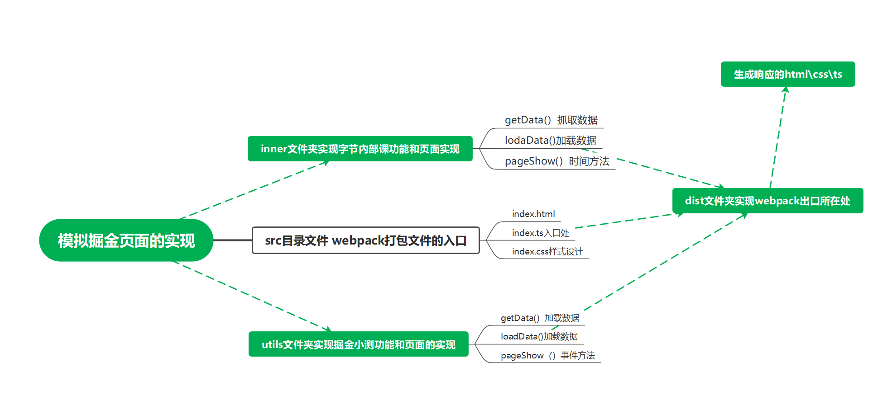

此目录存放本周课后作业，可以在此文件添加作业设计思路和流程图等



使用whistle进行跨域

通过 webpack 将一系列事件打包使用 ， 通过 eslint prettier 来检查代码问题和逻辑

可以将数据抓包，然后通过 id 通过 fetch 去抓取数据页面渲染，

```
export const list1 = [
  { category_id: '0', category_name: '全部' },
  { category_id: '6809637769959178254', category_name: '后端' },
  { category_id: '6809637767543259144', category_name: '前端' },
  { category_id: '6809635626879549454', category_name: 'Android' },
  { category_id: '6809635626661445640', category_name: 'iOS' },
  { category_id: '6809637773935378440', category_name: '人工智能' },
  { category_id: '6809637771511070734', category_name: '开发工具' },
  { category_id: '6809637776263217160', category_name: '代码人生' },
  { category_id: '6809637772874219534', category_name: '阅读' }
]
```

在 homework 中建立一个文件夹 ts_webpack 用来存放代码 src 文件夹 webpack 入口, dist 是文件出口 ,utils 和 inner 文件逻辑


